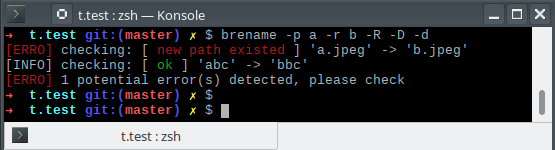
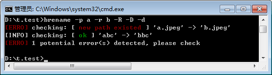

# brename -- a practical cross-platform command-line tool for safely batch renaming files/directories via regular expression

[](https://golang.org)
[](https://goreportcard.com/report/github.com/shenwei356/brename)
[](#download)
[](https://github.com/shenwei356/brename/releases)
[](https://github.com/shenwei356/brename/releases)

`brename` is a cross-platform command-line tool for safely batch renaming files/directories via regular expression.

## Table of Contents
<!-- START doctoc generated TOC please keep comment here to allow auto update -->
<!-- DON'T EDIT THIS SECTION, INSTEAD RE-RUN doctoc TO UPDATE -->

- [Features](#features)
- [Installation](#installation)
- [Usage](#usage)
- [Examples](#examples)
- [Real-world examples](#real-world-examples)
- [Contact](#contact)
- [License](#license)
- [Starchart](#starchart)

<!-- END doctoc generated TOC please keep comment here to allow auto update -->

## Features

- **Cross-platform**. Supporting Windows, Mac OS X and Linux.
    - Windows file systems, including NTFS and FAT, are case-insensitive.
    Some operations are allowed on Linux, while they could be dangerous on Windows.
    [For example](https://github.com/shenwei356/brename/issues/28), renaming `test.tar.gz` to `test.tar` will overwrite `TEST.tar`. 
    `brename` (v2.13.0 and later versions) can handle these cases appropriately.
- **Safe**. By ***checking potential conflicts and errors***.
- **Supporting Undo** the LAST successful operation.
- **Overwrite can be detected and users can choose whether overwrite or leave it**.
- **File filtering**. Supporting including and excluding files via regular expression.
    No need to run commands like `find ./ -name "*.html" -exec CMD`.
- **Renaming submatch with corresponding value via key-value file**.
- **Renaming via ascending integer**.
- **Recursively renaming both files and directories**.
- **Supporting dry run**.
- **Colorful output**. Screenshots:
    - Linux

        
    - Windows

        


## Installation

`brename` is implemented in [Go](https://golang.org/) programming language,
 executable binary files **for most popular operating systems** are freely available
  in [release](https://github.com/shenwei356/brename/releases) page.

#### Method 1: Download binaries

[brename v2.12.0](https://github.com/shenwei356/brename/releases/tag/v2.12.0)
[](https://github.com/shenwei356/brename/releases/tag/v2.12.0)

***Tip: run `brename -V` to check update !!!***

OS     |Arch      |File, 中国镜像                                                                                                                                                                              |Download Count
:------|:---------|:-------------------------------------------------------------------------------------------------------------------------------------------------------------------------------------------------------------|:-----------------------------------------------------------------------------------------------------------------------------------------------------------------------------------------------------------------------------------------------
Linux  |32-bit    |[brename_linux_386.tar.gz](https://github.com/shenwei356/brename/releases/download/v2.12.0/brename_linux_386.tar.gz),<br/> [中国镜像](http://app.shenwei.me/data/brename/brename_linux_386.tar.gz)                            |[](https://github.com/shenwei356/brename/releases/download/v2.12.0/brename_linux_386.tar.gz)
Linux  |**64-bit**|[**brename_linux_amd64.tar.gz**](https://github.com/shenwei356/brename/releases/download/v2.12.0/brename_linux_amd64.tar.gz),<br/> [中国镜像](http://app.shenwei.me/data/brename/brename_linux_amd64.tar.gz)                  |[](https://github.com/shenwei356/brename/releases/download/v2.12.0/brename_linux_amd64.tar.gz)
Linux  |arm64     |[**brename_linux_arm64.tar.gz**](https://github.com/shenwei356/brename/releases/download/v2.12.0/brename_linux_arm64.tar.gz),<br/> [中国镜像](http://app.shenwei.me/data/brename/brename_linux_arm64.tar.gz)                  |[](https://github.com/shenwei356/brename/releases/download/v2.12.0/brename_linux_arm64.tar.gz)
OS X   |**64-bit**|[**brename_darwin_amd64.tar.gz**](https://github.com/shenwei356/brename/releases/download/v2.12.0/brename_darwin_amd64.tar.gz),<br/> [中国镜像](http://app.shenwei.me/data/brename/brename_darwin_amd64.tar.gz)               |[](https://github.com/shenwei356/brename/releases/download/v2.12.0/brename_darwin_amd64.tar.gz)
OS X   |arm64     |[**brename_darwin_arm64.tar.gz**](https://github.com/shenwei356/brename/releases/download/v2.12.0/brename_darwin_arm64.tar.gz),<br/> [中国镜像](http://app.shenwei.me/data/brename/brename_darwin_arm64.tar.gz)               |[](https://github.com/shenwei356/brename/releases/download/v2.12.0/brename_darwin_arm64.tar.gz)
Windows|32-bit    |[brename_windows_386.exe.tar.gz](https://github.com/shenwei356/brename/releases/download/v2.12.0/brename_windows_386.exe.tar.gz),<br/> [中国镜像](http://app.shenwei.me/data/brename/brename_windows_386.exe.tar.gz)          |[](https://github.com/shenwei356/brename/releases/download/v2.12.0/brename_windows_386.exe.tar.gz)
Windows|**64-bit**|[**brename_windows_amd64.exe.tar.gz**](https://github.com/shenwei356/brename/releases/download/v2.12.0/brename_windows_amd64.exe.tar.gz),<br/> [中国镜像](http://app.shenwei.me/data/brename/brename_windows_amd64.exe.tar.gz)|[](https://github.com/shenwei356/brename/releases/download/v2.12.0/brename_windows_amd64.exe.tar.gz)


Just [download](https://github.com/shenwei356/brename/releases) compressed
executable file of your operating system,
and decompress it with `tar -zxvf *.tar.gz` command or other tools.
And then:

1. **For Linux-like systems**
    1. If you have root privilege simply copy it to `/usr/local/bin`:

            sudo cp brename /usr/local/bin/

    1. Or copy to anywhere in the environment variable `PATH`:

            mkdir -p $HOME/bin/; cp brename $HOME/bin/

1. **For windows**, just copy `brename.exe` to `C:\WINDOWS\system32`.

#### Method 2: For Go developer

    go get -u github.com/shenwei356/brename/

#### Method 3: For ArchLinux AUR users

    yaourt -S brename

#### Method 4: For Scoop users

    scoop install brename
    
#### Method 5: Compiling from source

    # download Go from https://go.dev/dl
    wget https://go.dev/dl/go1.17.13.linux-amd64.tar.gz
    
    tar -zxf go1.17.13.linux-amd64.tar.gz -C $HOME/
    
    # or 
    #   echo "export PATH=$PATH:$HOME/go/bin" >> ~/.bashrc
    #   source ~/.bashrc
    export PATH=$PATH:$HOME/go/bin
    
    git clone https://github.com/shenwei356/brename
    cd brename
    
    go build
    
    # or statically-linked binary
    CGO_ENABLED=0 go build -tags netgo -ldflags '-w -s'
    
    # or cross compile for other operating systems and architectures
    CGO_ENABLED=0 GOOS=openbsd GOARCH=amd64 go build -tags netgo -ldflags '-w -s'

## Usage

```

brename -- a practical cross-platform command-line tool for safely batch renaming files/directories via regular expression

Version: 2.13.0

Author: Wei Shen <shenwei356@gmail.com>

Homepage: https://github.com/shenwei356/brename

Warnings:
  1. The path in file systems like NTFS is case-insensitive, so you should switch on the flag
     -w/--case-insensitive-path to correctly check file overwrites.

Three path filters:

  1. -S/--skip-filters       black list     default value: ^\. (skipping paths starting with ".")
  2. -F/--exclude-filters    black list     no default value
  3. -f/--include-filters    white list     default value: .   (anything)
  
  Notes: 
  1. Paths starting with "." are ignored by default, disable this with -S "".
  2. These options support multiple values, e.g., -f ".html" -f ".htm".
     But ATTENTION: each comma in filters is treated as a separator of multiple filters.
     Please use double quotation marks for patterns containing comma, e.g., -p '"A{2,}"'
  3. The three filters are performed in order of -S, -F, -f.
  4. -F/--exclude-filters is prefered for excluding path, cause it has no default value.
     Setting -S/--skip-filters will overwrite its default value.


Special replacement symbols:

  {nr}    Ascending integer
  {kv}    Corresponding value of the key (captured variable $n) by key-value file,
          n can be specified by flag -I/--key-capt-idx (default: 1)

Usage:
  brename [flags] 

Examples:
  1. dry run and showing potential dangerous operations
      brename -p "abc" -d
  2. dry run and only show operations that will cause error
      brename -p "abc" -d -v 2
  3. only renaming specific paths via include filters
      brename -p ":" -r "-" -f ".htm$" -f ".html$"
  4. renaming all .jpeg files to .jpg in all subdirectories
      brename -p "\.jpeg" -r ".jpg" -R   dir
  5. using capture variables, e.g., $1, $2 ...
      brename -p "(a)" -r "\$1\$1"
      or brename -p "(a)" -r '$1$1' in Linux/Mac OS X
  6. renaming directory too
      brename -p ":" -r "-" -R -D   pdf-dirs
  7. using key-value file
      brename -p "(.+)" -r "{kv}" -k kv.tsv
  8. do not touch file extension
      brename -p ".+" -r "{nr}" -f .mkv -f .mp4 -e
  9. only list paths that match pattern (-l)
      brename -i -f '.docx?$' -p . -R -l
  10. undo the LAST successful operation
      brename -u
  11. disable undo if you do not want to create .brename_detail.txt (-x)
      brename -p xxx -r yyy -x
  12. clear/remove all .brename_detail.txt files (--clear)
      brename --clear -R
  13. also operate on hidden files: empty -S (default: ^\.)
      brename -p xxx -r yyy -S ""

  More examples: https://github.com/shenwei356/brename

Flags:
  -w, --case-insensitive-path     the file system (e.g., NTFS) is case-insensitive. Please use this flag
                                  on Windows for safety
      --clear                     remove all .brename_detail.txt" file, you may need to add
                                  -R/--recursive to recursively clear all files in the given path
  -x, --disable-undo              do not create .brename_detail.txt file for undo
  -d, --dry-run                   print rename operations but do not run
  -F, --exclude-filters strings   exclude file filter(s) (regular expression, NOT wildcard). multiple
                                  values supported, e.g., -F ".html" -F ".htm", but ATTENTION: each
                                  comma in the filter is treated as the separator of multiple filters,
                                  please use double quotation marks for patterns containing comma, e.g.,
                                  -p '"A{2,}"'
  -U, --force-undo                continue undo even when some operations failed
  -h, --help                      help for brename
  -i, --ignore-case               ignore case of -p/--pattern, -f/--include-filters and -F/--exclude-filters
  -e, --ignore-ext                ignore file extension. i.e., replacement does not change file extension
  -f, --include-filters strings   include file filter(s) (regular expression, NOT wildcard). multiple
                                  values supported, e.g., -f ".html" -f ".htm", but ATTENTION: each
                                  comma in the filter is treated as the separator of multiple filters,
                                  please use double quotation marks for patterns containing comma, e.g.,
                                  -p '"A{2,}"' (default [.])
  -D, --including-dir             rename directories
  -K, --keep-key                  keep the key as value when no value found for the key
  -I, --key-capt-idx int          capture variable index of key (1-based) (default 1)
  -m, --key-miss-repl string      replacement for key with no corresponding value
  -k, --kv-file string            tab-delimited key-value file for replacing key with value when using
                                  "{kv}" in -r (--replacement)
  -l, --list                      only list paths that match pattern
  -a, --list-abs                  list absolute path, using along with -l/--list
  -s, --list-sep string           separator for list of found paths (default "\n")
      --max-depth int             maximum depth for recursive search (0 for no limit)
  -N, --nature-sort               list paths in nature sort, using along with -l/--list
      --nr-width int              minimum width for {nr} in flag -r/--replacement. e.g., formating "1"
                                  to "001" by --nr-width 3 (default 1)
      --only-dir                  only rename directories
  -o, --overwrite-mode int        overwrite mode (0 for reporting error, 1 for overwrite, 2 for not
                                  renaming) (default 0)
  -p, --pattern string            search pattern (regular expression)
  -q, --quiet                     be quiet, do not show information and warning
  -R, --recursive                 rename recursively
  -r, --replacement string        replacement. capture variables supported.  e.g. $1 represents the
                                  first submatch. ATTENTION: for *nix OS, use SINGLE quote NOT double
                                  quotes or use the \ escape character. Ascending integer is also
                                  supported by "{nr}"
  -S, --skip-filters strings      skip file filter(s) (regular expression, NOT wildcard). multiple
                                  values supported, e.g., -S "^\." for skipping files starting with a
                                  dot, but ATTENTION: each comma in the filter is treated as the
                                  separator of multiple filters, please use double quotation marks for
                                  patterns containing comma, e.g., -p '"A{2,}"' (default [^\.])
  -n, --start-num int             starting number when using {nr} in replacement (default 1)
  -u, --undo                      undo the LAST successful operation
  -v, --verbose int               verbose level (0 for all, 1 for warning and error, 2 for only error)
                                  (default 0)
  -V, --version                   print version information and check for update

```


## Examples

Take a directory for example (run `generate-example-folder.sh` to generate)

    $ sh generate-example-folder.sh 
    example
    ├── abc
    │   ├── A.JPEG
    │   ├── B.HTM
    │   └── B.JPEG
    ├── a.html
    ├── a.jpeg
    └── b.jpeg

    # examples below were executed in directory: example
    cd example/


1. Recursively renaming all `.jpeg` files to `.jpg` in all subdirectories (`-R/--recursive`).
 A dry run is firstly performed for safety checking (`-d/--dry-run`).

        $ brename -p "\.jpeg" -r ".jpg" -R -d
        [INFO] main options:
        [INFO]   ignore case: false
        [INFO]   search pattern: \.jpeg
        [INFO]   include filters: .
        [INFO]   search paths: ./
        [INFO] 
        [INFO] checking: [ ok ] 'a.jpeg' -> 'a.jpg'
        [INFO] checking: [ ok ] 'b.jpeg' -> 'b.jpg'
        [INFO] 2 path(s) to be renamed


        $ brename -p "\.jpeg" -r ".jpg" -R
        [INFO] main options:
        [INFO]   ignore case: false
        [INFO]   search pattern: \.jpeg
        [INFO]   include filters: .
        [INFO]   search paths: ./
        [INFO] 
        [INFO] checking: [ ok ] 'a.jpeg' -> 'a.jpg'
        [INFO] checking: [ ok ] 'b.jpeg' -> 'b.jpg'
        [INFO] 2 path(s) to be renamed
        [INFO] renamed: 'a.jpeg' -> 'a.jpg'
        [INFO] renamed: 'b.jpeg' -> 'b.jpg'
        [INFO] 2 path(s) renamed

        $ tree
        .
        ├── abc
        │   ├── A.JPEG
        │   ├── B.HTM
        │   └── B.JPEG
        ├── a.html
        ├── a.jpg
        └── b.jpg


1. **Undo** the LAST successful operation, yes it's COOL! (`-u/--undo`, `-U/--force-undo`)
    
        $ brename -u
        [INFO] rename back: 'b.jpg' -> 'b.jpeg'
        [INFO] rename back: 'a.jpg' -> 'a.jpeg'
        [INFO] 2 path(s) renamed
        
   Disable undo if you do not want to create .brename_detail.txt (`-x`)
   
        $ brename -p xxx -r yyy -x
        
   Clear/remove all .brename_detail.txt files (`--clear`)
  
        $ brename --clear -R
    
1. Dry run and only showing operations that will cause error (`-v/--verbose`)

        # default value of -v is 0
        $ brename -p a -r b -R -D -d
        [INFO] checking: [ ok ] 'a.html' -> 'b.html'
        [ERRO] checking: [ new path existed ] 'a.jpg' -> 'b.jpg'
        [INFO] checking: [ ok ] 'abc' -> 'bbc'
        [ERRO] 1 potential error(s) detected, please check

        $ brename -p a -r b -R -D -d -v 2
        [ERRO] checking: [ new path existed ] 'a.jpg' -> 'b.jpg'
        [ERRO] 1 potential error(s) detected, please check

1. Ignoring cases (`-i/--ignore-case`)

        $ brename -p "\.jpeg" -r ".jpg" -R -i
        [INFO] checking: [ ok ] 'abc/A.JPEG' -> 'abc/A.jpg'
        [INFO] checking: [ ok ] 'abc/B.JPEG' -> 'abc/B.jpg'
        [INFO] 2 path(s) to be renamed
        [INFO] renamed: 'abc/A.JPEG' -> 'abc/A.jpg'
        [INFO] renamed: 'abc/B.JPEG' -> 'abc/B.jpg'
        [INFO] 2 path(s) renamed

        $ tree
        .
        ├── abc
        │   ├── A.jpg
        │   ├── B.HTM
        │   └── B.jpg
        ├── a.html
        ├── a.jpg
        └── b.jpg

1. Using capture variables, e.g., $1, $2 ...

        # or brename -p "(a)" -r '$1$1' in Linux/Mac OS X
        $ brename -p "(a)" -r "\$1\$1" -i
        [INFO] checking: [ ok ] 'a.html' -> 'aa.html'
        [INFO] checking: [ ok ] 'a.jpg' -> 'aa.jpg'
        [INFO] 2 path(s) to be renamed
        [INFO] renamed: 'a.html' -> 'aa.html'
        [INFO] renamed: 'a.jpg' -> 'aa.jpg'
        [INFO] 2 path(s) renamed

        $ tree
        .
        ├── aa.html
        ├── aa.jpg
        ├── abc
        │   ├── A.jpg
        │   ├── B.HTM
        │   └── B.jpg
        └── b.jpg

1. Renaming directory too (`-D/--including-dir`), even renaming directory only (`-D --only-dir`)

        $ brename -p "a" -r "A" -R -D
        [INFO] checking: [ ok ] 'aa.html' -> 'AA.html'
        [INFO] checking: [ ok ] 'aa.jpg' -> 'AA.jpg'
        [INFO] checking: [ ok ] 'abc' -> 'Abc'
        [INFO] 3 path(s) to be renamed
        [INFO] renamed: 'aa.html' -> 'AA.html'
        [INFO] renamed: 'aa.jpg' -> 'AA.jpg'
        [INFO] renamed: 'abc' -> 'Abc'
        [INFO] 3 path(s) renamed

        $ tree
        .
        ├── AA.html
        ├── AA.jpg
        ├── Abc
        │   ├── A.jpg
        │   ├── B.HTM
        │   └── B.jpg
        └── b.jpg


1. **Only renaming specific files via include filters (regular expression) (`-f/--include-filters`)**

        $ brename -p '(.)' -r '$1 ' -d
        [INFO] main options:
        [INFO]   ignore case: false
        [INFO]   search pattern: (.)
        [INFO]   include filters: .
        [INFO]   search paths: ./
        [INFO] 
        [INFO] checking: [ ok ] 'AA.html' -> 'A A . h t m l '
        [INFO] checking: [ ok ] 'AA.jpg' -> 'A A . j p g '
        [INFO] checking: [ ok ] 'b.jpg' -> 'b . j p g '
        [INFO] 3 path(s) to be renamed

        
        $ brename -p '(.)' -r '$1 ' -d -f '\.jpg$'
        [INFO] main options:
        [INFO]   ignore case: false
        [INFO]   search pattern: (.)
        [INFO]   include filters: \.jpg$
        [INFO]   search paths: ./
        [INFO] 
        [INFO] checking: [ ok ] 'AA.jpg' -> 'A A . j p g '
        [INFO] checking: [ ok ] 'b.jpg' -> 'b . j p g '
        [INFO] 2 path(s) to be renamed


    ***Attention: value of `-f/--include-filters` and `-F/--exclude-filters` should be regular expression, NOT wildcard!***
        
        $ brename -p '(.)' -r '$1 ' -d -f *.jpg
        [WARN] Seems you are using wildcard for -f/--include-filters? Make sure using regular expression: AA.jpg
        [INFO] main options:
        [INFO]   ignore case: false
        [INFO]   search pattern: (.)
        [INFO]   include filters: AA.jpg
        [INFO]   search paths: b.jpg
        [INFO] 
        [INFO] 0 path(s) to be renamed
        
        $ brename -p '(.)' -r '$1 ' -d -f '*.jpg'
        [WARN] Are you using wildcard for -f/--include-filters? It should be regular expression: *.jpg
        [ERRO] illegal regular expression for include filter: *.jpg
        
        $ brename -p '(.)' -r '$1 ' -d -f A*
        [WARN] Seems you are using wildcard for -f/--include-filters? Make sure using regular expression: AA.html
        [INFO] main options:
        [INFO]   ignore case: false
        [INFO]   search pattern: (.)
        [INFO]   include filters: AA.html
        [INFO]   search paths: AA.jpg, Abc
        [INFO] 
        [INFO] 0 path(s) to be renamed

1. Excluding files via exclude filters (regular expression) (`-F/--exclude-filters`)

        $ brename -p '(.)' -r '$1 ' -d
        [INFO] checking: [ ok ] 'AA.jpg' -> 'A A . j p g '
        [INFO] checking: [ ok ] 'b.jpg' -> 'b . j p g '
        [INFO] checking: [ ok ] 'hello AA.html' -> 'h e l l o   A A . h t m l '
        [INFO] 3 path(s) to be renamed


        $ brename -p '(.)' -r '$1 ' -d -F '\.html$'
        [INFO] checking: [ ok ] 'AA.jpg' -> 'A A . j p g '
        [INFO] checking: [ ok ] 'b.jpg' -> 'b . j p g '
        [INFO] 2 path(s) to be renamed
        
1. Skipping files via skip filter (regular expression) (`-S/--skip-filters`). This filter step is performed before the exclude filters.
  The default value `^\.` is for skipping files starting with dot, which are hidden configuration files in Linux.
  If you do not want to skip these paths, just empty it.
  
        $ brename -p xxx -r yyy -S ""


1. Do not touch file extension (`-e/--ignore-ext`)

        $ brename -p '(.)' -r '$1 ' -d
        [INFO] checking: [ ok ] 'AA.jpg' -> 'A A . j p g '
        [INFO] checking: [ ok ] 'b.jpg' -> 'b . j p g '
        [INFO] checking: [ ok ] 'hello AA.html' -> 'h e l l o   A A . h t m l '
        [INFO] 3 path(s) to be renamed

        $ brename -p '(.)' -r '$1 ' -d -e
        [INFO] checking: [ ok ] 'AA.jpg' -> 'A A .jpg'
        [INFO] checking: [ ok ] 'b.jpg' -> 'b .jpg'
        [INFO] checking: [ ok ] 'hello AA.html' -> 'h e l l o   A A .html'
        [INFO] 3 path(s) to be renamed

1. Renaming with number (-r `{nr}`)

        $ brename -d -p '(.+)\.' -r 'pic-{nr}.' -f .jpg -d
        [INFO] checking: [ ok ] 'AA.jpg' -> 'pic-1.jpg'
        [INFO] checking: [ ok ] 'b.jpg' -> 'pic-2.jpg'
        [INFO] 2 path(s) to be renamed

        $ brename -d -p '(.+)\.' -r 'pic-{nr}.' -f .jpg -d --nr-width 3 --start-num 11
        [INFO] checking: [ ok ] 'AA.jpg' -> 'pic-011.jpg'
        [INFO] checking: [ ok ] 'b.jpg' -> 'pic-012.jpg'
        [INFO] 2 path(s) to be renamed

1. Replace submatch with corresponding value via tab delimited key-value file (`-k/--kv-file`)

        $ more kv.tsv
        a       一
        b       二
        c       三

        $ brename -p '^(\w)' -r '{kv}' -k kv.tsv -K -i -d
        [INFO] read key-value file: kv.tsv
        [INFO] 3 pairs of key-value loaded
        [INFO] checking: [ ok ] 'AA.jpg' -> '一A.jpg'
        [INFO] checking: [ ok ] 'b.jpg' -> '二.jpg'
        [WARN] checking: [ unchanged ] 'hello b.html' -> 'hello b.html'
        [WARN] checking: [ unchanged ] 'kv.tsv' -> 'kv.tsv'

1. Auto mkdir

        $ brename -f .txt -p '-' -r '/'
        [INFO] checking: [ ok ] 'a-b-c.txt' -> 'a/b/c.txt'
        [INFO] 1 path(s) to be renamed
        [INFO] renamed: 'a-b-c.txt' -> 'a/b/c.txt'
        [INFO] 1 path(s) renamed

        $ tree a
        a
        └── b
            └── c.txt

1. Only listing paths that match pattern (`-l` and `-a`)

        $ brename -p '.gz$' -R -l
        binaries/brename_darwin_386.tar.gz
        binaries/brename_darwin_amd64.tar.gz
        binaries/brename_linux_386.tar.gz
        binaries/brename_linux_amd64.tar.gz
        binaries/brename_windows_386.exe.tar.gz
        binaries/brename_windows_amd64.exe.tar.gz

        $ brename -p '.gz$' -R -l -a
        /home/shenwei/project/src/github.com/shenwei356/brename/binaries/brename_darwin_386.tar.gz
        /home/shenwei/project/src/github.com/shenwei356/brename/binaries/brename_darwin_amd64.tar.gz
        /home/shenwei/project/src/github.com/shenwei356/brename/binaries/brename_linux_386.tar.gz
        /home/shenwei/project/src/github.com/shenwei356/brename/binaries/brename_linux_amd64.tar.gz
        /home/shenwei/project/src/github.com/shenwei356/brename/binaries/brename_windows_386.exe.tar.gz
        /home/shenwei/project/src/github.com/shenwei356/brename/binaries/brename_windows_amd64.exe.tar.gz

1. Overwrite mode (`-o/--overwrite-mode`)

        $ ls *.tar.gz
        brename_darwin_386.tar.gz    brename_linux_386.tar.gz    brename_windows_386.exe.tar.gz
        brename_darwin_amd64.tar.gz  brename_linux_amd64.tar.gz  brename_windows_amd64.exe.tar.gz

    1. default mode: reporting error

            $ brename -p 386 -r amd64 -d
            [ERRO] checking: [ new path existed ] 'brename_darwin_386.tar.gz' -> 'brename_darwin_amd64.tar.gz'
            [ERRO] checking: [ new path existed ] 'brename_linux_386.tar.gz' -> 'brename_linux_amd64.tar.gz'
            [ERRO] checking: [ new path existed ] 'brename_windows_386.exe.tar.gz' -> 'brename_windows_amd64.exe.tar.gz'
            [ERRO] 3 potential error(s) detected, please check

    1. allowing overwrite

            $ brename -p 386 -r amd64 -d -o 1
            [WARN] checking: [ new path existed ] 'brename_darwin_386.tar.gz' -> 'brename_darwin_amd64.tar.gz' (will be overwrited)
            [WARN] checking: [ new path existed ] 'brename_linux_386.tar.gz' -> 'brename_linux_amd64.tar.gz' (will be overwrited)
            [WARN] checking: [ new path existed ] 'brename_windows_386.exe.tar.gz' -> 'brename_windows_amd64.exe.tar.gz' (will be overwrited)
            [INFO] 3 path(s) to be renamed

    1. leave it

            $ brename -p 386 -r amd64 -d -o 2
            [WARN] checking: [ new path existed ] 'brename_darwin_386.tar.gz' -> 'brename_darwin_amd64.tar.gz' (will NOT be overwrited)
            [WARN] checking: [ new path existed ] 'brename_linux_386.tar.gz' -> 'brename_linux_amd64.tar.gz' (will NOT be overwrited)
            [WARN] checking: [ new path existed ] 'brename_windows_386.exe.tar.gz' -> 'brename_windows_amd64.exe.tar.gz' (will NOT be overwrited)
            [INFO] 0 path(s) to be renamed

    1. this flag also works for another case, where two or more files are renamed to same new path

            $ brename -f 386 -p 'darwin|linux' -r unix-like -d
            [INFO] checking: [ ok ] 'brename_darwin_386.tar.gz' -> 'brename_unix-like_386.tar.gz'
            [ERRO] checking: [ overwriting newly renamed path ] 'brename_linux_386.tar.gz' -> 'brename_unix-like_386.tar.gz'
            [ERRO] 1 potential error(s) detected, please check

            $ brename -f 386 -p 'darwin|linux' -r unix-like -d -o 1
            [INFO] checking: [ ok ] 'brename_darwin_386.tar.gz' -> 'brename_unix-like_386.tar.gz'
            [WARN] checking: [ overwriting newly renamed path ] 'brename_linux_386.tar.gz' -> 'brename_unix-like_386.tar.gz' (will be overwrited)
            [INFO] 2 path(s) to be renamed

            $ brename -f 386 -p 'darwin|linux' -r unix-like -d -o 2
            [INFO] checking: [ ok ] 'brename_darwin_386.tar.gz' -> 'brename_unix-like_386.tar.gz'
            [WARN] checking: [ overwriting newly renamed path ] 'brename_linux_386.tar.gz' -> 'brename_unix-like_386.tar.gz' (will NOT be overwrited)
            [INFO] 1 path(s) to be renamed

## Real-world examples

1. Replace matches with corresponding pairing values

    1. Original files

            $ tree
            .
            ├── barcodes.tsv
            ├── tag_ATGCGTA.fasta
            ├── tag_CCCCCCC.fasta
            ├── tag_CGACGTC.fasta
            ├── tag_TCATAGC.fasta
            └── tag_TCTATAG.fasta

    1. Tab-delimited key-value file. Notice that `CCCCCCC` is not in it.

            $ cat barcodes.tsv
            CGACGTC S1
            ATGCGTA S2
            TCTATAG S4
            TCATAGC S3

    1. Renaming tag as sample name, marking `unknown` for non-existing tag.

            $ brename -e -p 'tag_(\w+)' -r '{kv}' -k barcodes.tsv -m unknown -d
            [INFO] read key-value file: barcodes.tsv
            [INFO] 4 pairs of key-value loaded
            [INFO] checking: [ ok ] 'tag_ATGCGTA.fasta' -> 'S2.fasta'
            [INFO] checking: [ ok ] 'tag_CCCCCCC.fasta' -> 'unknown.fasta'
            [INFO] checking: [ ok ] 'tag_CGACGTC.fasta' -> 'S1.fasta'
            [INFO] checking: [ ok ] 'tag_TCATAGC.fasta' -> 'S3.fasta'
            [INFO] checking: [ ok ] 'tag_TCTATAG.fasta' -> 'S4.fasta'
            [INFO] 5 path(s) to be renamed

1. Renaming PDF files for compatibility (moving from `EXT4` to `NTFS` file system):

    1. Original files

            $ tree -Q
            .
            ├── "0000 Test.pdf"
            ├── "2016 SeqKit: A Cross-Platform and Ultrafast Toolkit for FASTA\342\201\204Q File Manipulation .pdf"
            ├── "metagenomics"
            │   ├── "2017 16S rRNA gene sequencing and healthy reference ranges for 28 clinically relevant microbial taxa from the human gut microbiome .pdf"
            │   ├── "2017 De novo assembly of viral quasispecies using overlap graphs .pdf"
            │   └── "2017 Tracking microbial colonization in fecal microbiota transplantation experiments via genome-resolved metagenomics .pdf"
            ├── "test2222222222222222222211111111122222222222222222233333333.pdf"
            └── "test.pdf"

    1. Removing "\n", "'", "?".

            $ brename -p "[\n'\?]" -r " " -R
            
    1. Replacing ":" with " _"

            $ brename -p ":" -r " _" -R

    1. Shortening file names (prefering spliting with space)

            $ brename -R -f .pdf -i -p "^(.{30,50})[ \.].*.pdf" -r "\$1.pdf" -d

    1. Result

            $ tree -Q
            .
            ├── "0000 Test.pdf"
            ├── "2016 SeqKit _ A Cross-Platform and Ultrafast.pdf"
            ├── "metagenomics"
            │   ├── "2017 16S rRNA gene sequencing and healthy.pdf"
            │   ├── "2017 De novo assembly of viral quasispecies using.pdf"
            │   └── "2017 Tracking microbial colonization in fecal.pdf"
            ├── "test2222222222222222222211111111122222222222222222233333333.pdf"
            └── "test.pdf"

## Contact

[Create an issue](https://github.com/shenwei356/brename/issues) to report bugs,
propose new functions or ask for help.

## License

[MIT License](https://github.com/shenwei356/brename/blob/master/LICENSE)

## Starchart


